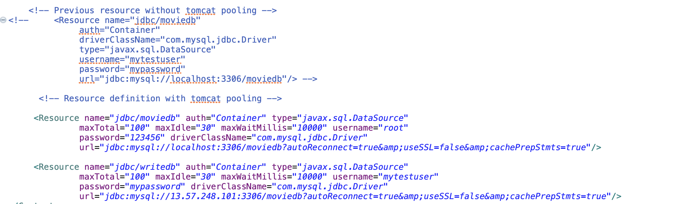
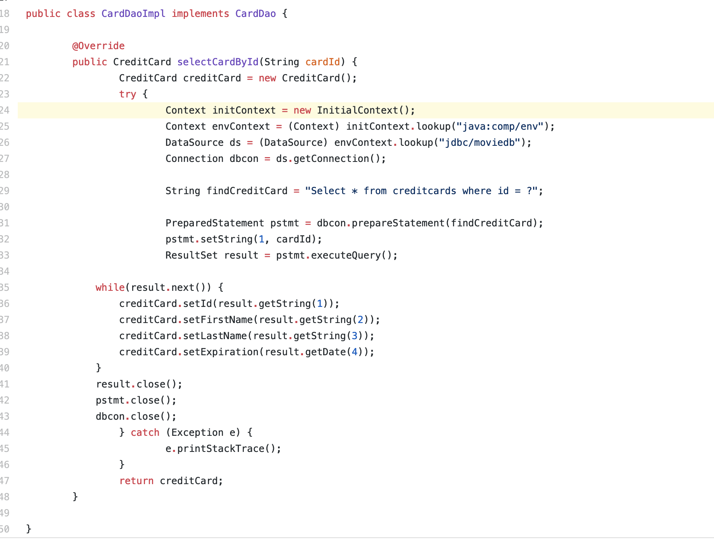
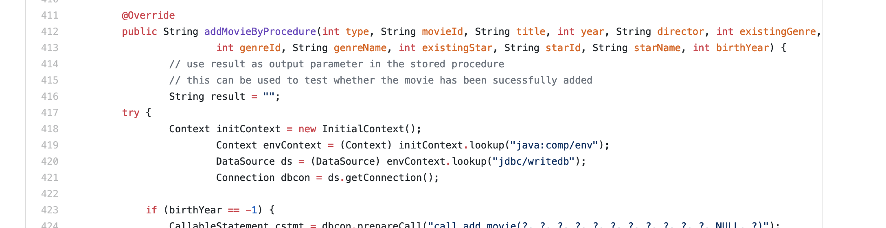

# Project 5 summary
## TASK1: JDBC connection pooling
### DataBase Connection Configuration
- Prepared Statement: it is implement in every servlet. The locations are mention below in the database connection pooling, the places are the same. In the project, preparedStatement is used to pre-compile the SQL sentences and process it afterwards. This will increase the efficiency when when the SQL is reused to fill some potential placeholders.
- Database connection is configured in the context.xml, see the link below.
-  Database connection pooling is used to reuse the connection resources in a pool, this will save the cost of creating connections. It is configured in the context.xml, the link is listed below.

### Places where database connection pooling is used
- context.xml:
    - line 18
    - line 23
>https://github.com/UCI-Chenli-teaching/cs122b-winter19-team-10/blob/master/cs122b-project/WebContent/META-INF/context.xml

### How is it used

- we search for a data source to search for a available connection. The general format of access the JDBC connection pool is the same.

### Where tomcat pooling is used
1. [CardDaoImpl.java](https://github.com/UCI-Chenli-teaching/cs122b-winter19-team-10/blob/master/cs122b-project/src/com/cs122b/fablix/dao/Impl/CardDaoImpl.java)
- line 24
2. [CustomerDaoImpl.java](https://github.com/UCI-Chenli-teaching/cs122b-winter19-team-10/blob/master/cs122b-project/src/com/cs122b/fablix/dao/Impl/CustomerDaoImpl.java)
- line 29
- line 57
3. [EmployeeDaoImpl](https://github.com/UCI-Chenli-teaching/cs122b-winter19-team-10/blob/master/cs122b-project/src/com/cs122b/fablix/dao/Impl/EmployeeDaoImpl.java)
- line 25
- line 53
4. [FuzzySearchDaoImpl.java](https://github.com/UCI-Chenli-teaching/cs122b-winter19-team-10/blob/master/cs122b-project/src/com/cs122b/fablix/dao/Impl/FuzzySearchDaoImpl.java)
- line 23
5. [GenreDaoImpl.java](https://github.com/UCI-Chenli-teaching/cs122b-winter19-team-10/blob/master/cs122b-project/src/com/cs122b/fablix/dao/Impl/GenreDaoImpl.java)
- line 26
- line 59
- line 86
- line 117
- line 148
6. [MetaDaoImpl.java](https://github.com/UCI-Chenli-teaching/cs122b-winter19-team-10/blob/master/cs122b-project/src/com/cs122b/fablix/dao/Impl/MetadataImpl.java)
- line 23
7. [MovieDaoImpl.java](https://github.com/UCI-Chenli-teaching/cs122b-winter19-team-10/blob/master/cs122b-project/src/com/cs122b/fablix/dao/Impl/MovieDaoImpl.java)
- line 28
- line 62
- line 96
- line 134
- line 165
- line 213
- line 286
- line 329
- line 360
- linr 392
- line 418

- line 473
- line 502
- line 555
8. [RatingDaoImpl](https://github.com/UCI-Chenli-teaching/cs122b-winter19-team-10/blob/master/cs122b-project/src/com/cs122b/fablix/dao/Impl/RatingDaoImpl.java)
- line 21
- line 47
9. [SalesDaoImpl.java](https://github.com/UCI-Chenli-teaching/cs122b-winter19-team-10/blob/master/cs122b-project/src/com/cs122b/fablix/dao/Impl/SalesDaoImpl.java)
- line 29
10. [StarDaoImpl.java](https://github.com/UCI-Chenli-teaching/cs122b-winter19-team-10/blob/master/cs122b-project/src/com/cs122b/fablix/dao/Impl/StarDaoImpl.java)
- line 26
- line 55
- line 81
- line 106
- line 126
- line 155

## TASK 2:
### Google cloud platform ip: http://35.236.56.154/cs122b-project/page/login.html
### AWS platform ip: http://52.53.158.173/cs122b-project/page/login.html
### instance2: http://13.57.248.101:8080/cs122b-project/page/login.html
### instance3: http://54.153.23.28:8080/cs122b-project/page/login.html

### Verified the instance: Right, Fablix site get opened both on Google’s 80 port and AWS’ 8080 port.

### Connection pooling with two backend servers
- context.xml:
    - line 18
    - line 23
>https://github.com/UCI-Chenli-teaching/cs122b-winter19-team-10/blob/master/cs122b-project/WebContent/META-INF/context.xml

### How read/write requests were routed?
- The load balancer will evenly distributed the requests to two backend servers. When a read request hit a server, it will use the local database connection to request data. If it is a write request, it will be send to master instance(instance 2).

- Read requests

- Write request example
    - https://github.com/UCI-Chenli-teaching/cs122b-winter19-team-10/blob/master/cs122b-project/src/com/cs122b/fablix/dao/Impl/SalesDaoImpl.java: line 31
    - https://github.com/UCI-Chenli-teaching/cs122b-winter19-team-10/blob/master/cs122b-project/src/com/cs122b/fablix/dao/Impl/MovieDaoImpl.java: line 418

    - https://github.com/UCI-Chenli-teaching/cs122b-winter19-team-10/blob/master/cs122b-project/src/com/cs122b/fablix/dao/Impl/StarDaoImpl.java: line126

## TASK 3
### log files: [log file link](Jmeter_Test_Result/LogFiles)

### HTML report of the Jmeter test: [Jmeter test link](Jmeter_Test_Result/JmeterReport/jmeter_report.html), you can download the folder to view the report. [folder link](Jmeter_Test_Result/JmeterReport)

### Script for processing the log file: [log processor file](LogProcessor/src/LogProcessor.java)

### WAR files and README explanation for WAR files
- [WAR file location](WAR_File)
- [WAR file explanation README file location](WAR_File/README.md)
